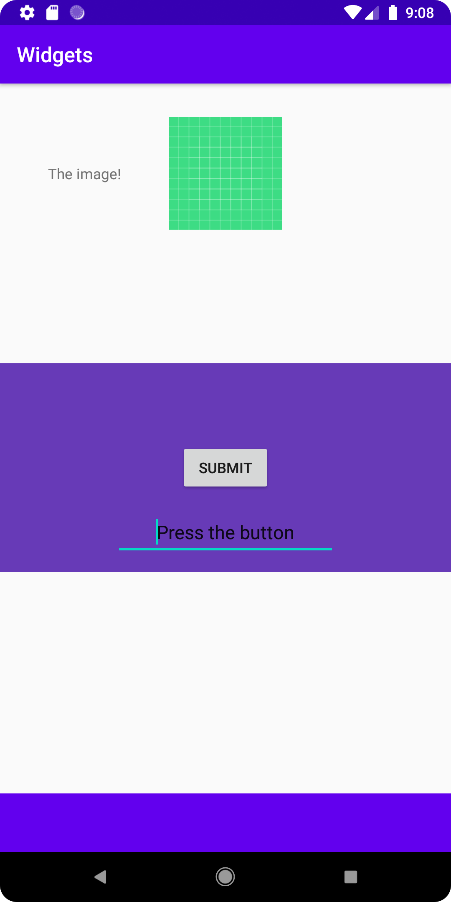

# Rapport

För widget uppgiften används ConstraintLayout för att positionera alla widgets i layouten.
I uppgiften har flera olika widgets använts för att skapa en så snygg och innehållrik layout som möjligt.
Ett ImageView element har skapats (se figur 1) där höjd och längd sätts på samma som innehållet.
Constraints för positionering går på parent med en vertical bias på 0 och sedan en margin top på 32dp.
Ett TextView element skapas (se figur 2) som positionerar sig efter ImageView elementet.
För att skapa en layout för att hålla andra element skapas en FrameLayout (se figur 3) som placeras i mitten
genom constraints mot sin parent åt alla håll. Bredden blir samma som sin parent och höjden sätts på 200dp.
I FrameLayout placeras ett button element (se figur 4) och ett EditText element (se figur 5).
Båda elementens constrains läggs på Framlayout elementet och varandra. 
Längst ner placeras ett Toolbar element (se figur 6) som har constraints på parent men genom 
vertical bias lika med 1 så läggs elementet längst ner på applikationen.

Figur 1
```` 
<ImageView
        android:id="@+id/imageView"
        android:layout_width="wrap_content"
        android:layout_height="wrap_content"
        android:layout_marginTop="32dp"
        android:contentDescription="GreenGrid"
        app:layout_constraintBottom_toBottomOf="parent"
        app:layout_constraintLeft_toLeftOf="parent"
        app:layout_constraintRight_toRightOf="parent"
        app:layout_constraintTop_toTopOf="parent"
        app:layout_constraintVertical_bias="0.0"
        app:srcCompat="@drawable/ic_launcher_background" />
````
Figur 2
````
<TextView
        android:id="@+id/textForImage"
        android:layout_width="wrap_content"
        android:layout_height="wrap_content"
        android:layout_marginTop="32dp"
        android:text="The image!"
        app:layout_constraintBottom_toBottomOf="@id/imageView"
        app:layout_constraintLeft_toLeftOf="parent"
        app:layout_constraintRight_toLeftOf="@id/imageView"
        app:layout_constraintTop_toTopOf="parent" />
````
Figur 3
````
<FrameLayout
        android:id="@+id/Frame"
        android:layout_width="match_parent"
        android:layout_height="200dp"
        android:background="#673AB7"
        app:layout_constraintBottom_toBottomOf="parent"
        app:layout_constraintLeft_toLeftOf="parent"
        app:layout_constraintRight_toRightOf="parent"
        app:layout_constraintTop_toTopOf="parent"/>
````
Figur 4
````
<Button
        android:id="@+id/button"
        android:layout_width="wrap_content"
        android:layout_height="wrap_content"
        android:text="Submit"
        app:layout_constraintBottom_toBottomOf="@id/Frame"
        app:layout_constraintLeft_toLeftOf="parent"
        app:layout_constraintRight_toRightOf="parent"
        app:layout_constraintTop_toTopOf="@id/Frame" />
````
Figur 5
````
<EditText
        android:id="@+id/editTextTextPersonName2"
        android:layout_width="wrap_content"
        android:layout_height="48dp"
        android:ems="10"
        android:inputType="textPersonName"
        android:text="Press the button"
        app:layout_constraintBottom_toBottomOf="@id/Frame"
        app:layout_constraintLeft_toLeftOf="parent"
        app:layout_constraintRight_toRightOf="parent"
        app:layout_constraintTop_toBottomOf="@id/button"
        android:textAlignment="center"/>
````
Figur 6
````
<androidx.appcompat.widget.Toolbar
        android:id="@+id/toolbar"
        android:layout_width="0dp"
        android:layout_height="wrap_content"
        android:background="?attr/colorPrimary"
        android:minHeight="?attr/actionBarSize"
        android:theme="?attr/actionBarTheme"
        app:layout_constraintBottom_toBottomOf="parent"
        app:layout_constraintLeft_toLeftOf="parent"
        app:layout_constraintRight_toRightOf="parent"
        app:layout_constraintTop_toTopOf="parent"
        app:layout_constraintVertical_bias="1.0" />
````
Bild

